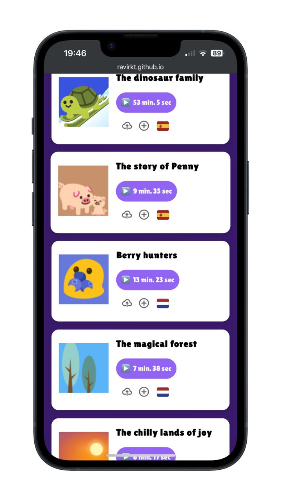

# Intro
Tumi-Mundo is een platform dat zich richt op het verbeteren en stimuleren van de taalontwikkeling van baby's van 6 maanden tot een jaar. Dit is belangrijk omdat een goede taalontwikkeling veel voordelen heeft, zoals het verbeteren van het leerproces, het verminderen van geestelijke gezondheidsproblemen en het vergroten van sociale vaardigheden.

Als schoolproject heb ik de opdracht gekregen van Tumi Mundo om de frontend van hun website te maken. Voor de eerste sprint was het de bedoeling dat de aangeleverde ontwerpen en de funcitonaliteiten daarin gerealiseerd moesten worden. Hierbij de vrijheid om een een ander design aan te houden en zelf te mogen bepalen welke pagina of functionaliteit de prioriteit kreeg.

Voor de eerste sprint was het doel om de ontwerpen en functionaliteiten die Tumi-Mundo heeft aangeleverd te realiseren. Ik had echter de vrijheid om een ander design te kiezen en zelf te bepalen welke pagina of functionaliteit de meeste prioriteit kreeg.

https://github.com/Ravirkt/the-client-website
https://github.com/Ravirkt/all-human-accessible-website

## Inhoudsopgave
- [Intro](#intro)
  - [Inhoudsopgave](#inhoudsopgave)
  - [Beschrijving](#beschrijving)
    - [Features](#features)
  - [Kenmerken](#kenmerken)
    - [HTMl-structuur](#html-structuur)
    - [CSS](#css)
    - [Javascript](#javascript)

## Beschrijving
In de derde sprint heb ik me gefocust op het ontwerp van de pagina's, met speciale aandacht voor de "All Stories"-pagina. Ik heb ervoor gezorgd dat deze pagina er mooi uitziet en gemakkelijk te gebruiken is. Daarbij heb ik de feedback van de sprintreview 2 toegepast om het ontwerp te verbeteren. Ook heb ik gewerkt aan de toegankelijkheid van de pagina's volgens de WCAG-richtlijnen, zodat iedereen de inhoud goed kan bekijken en gebruiken.

### Features
Storiespagina
De storiespagina geeft een overzicht van alle huidige verhalen. Dit maakt het gemakkelijk voor gebruikers om snel te vinden wat ze willen luisteren.

## Kenmerken

### HTMl-structuur
Ik heb de standaard HTML-structuur gebruikt om de applicatie te bouwen. Dit maakt het makkelijk om te begrijpen en te onderhouden. Ik heb ervoor gezorgd dat alles goed is georganiseerd en logisch is. Ook heb ik gekeken naar toegankelijkheid voor iedereen door de WCAG-richtlijnen te volgen. Zo kunnen ook mensen met andere behoeftes, zoals gebruikers van schermlezers, de applicatie goed gebruiken.

### CSS
Voor de CSS heb ik me gefocust op zowel de layout als de styling van de applicatie. Ik heb ervoor gekozen om de basis van het ontwerp dicht bij de aangeleverde designs te houden, zodat het herkenbaar blijft voor gebruikers. Tegelijkertijd heb ik mijn eigen ideeën toegevoegd om het ontwerp een frisse uitstraling te geven. Ook heb ik goed geluisterd naar de feedback die ik heb ontvangen, wat me heeft geholpen om het ontwerp verder te verbeteren.

### Javascript
In de applicatie heb ik JavaScript gebruikt voor interactie. Voor het openen en sluiten van de navbar heb ik gebruikgemaakt van query selectors. Daarnaast heb ik de play- en pauzeknop voor de video's ook met JavaScript gemaakt, waarbij ik event listeners heb gebruikt om te reageren op de acties van de gebruiker. Dit zorgt ervoor dat ze eenvoudig kunnen schakelen tussen afspelen en pauzeren.

